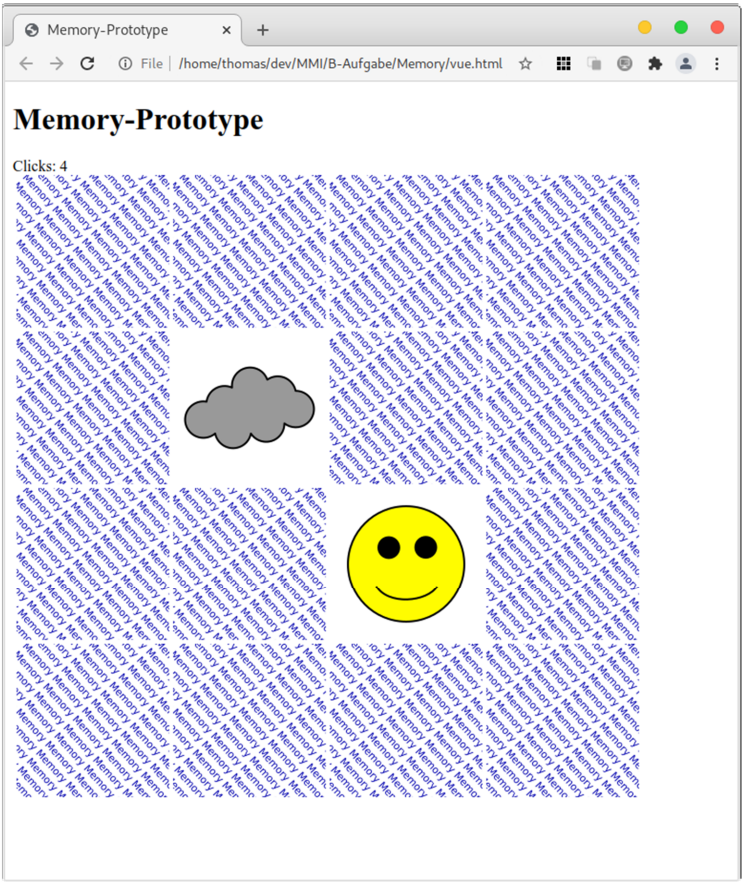

# Aufgabe 4, Memory-Prototyp (Vue)
Einsendeaufgabencode: B-MUMB01-XX1-N01  
Bearbeiter: Maxim Heibach  
Matrikelnummer: 909442      

## Aufgabe
In dieser Aufgabe sollen Sie einen einfachen Prototyp des Spiels „Memory“ mit Vue implementieren:



Ein Rahmenprogramm ist Ihnen wie folgt gegeben:

```sh
<!DOCTYPE html>
<html lang = "de">
    <head>
        <meta charset="utf-8">
        <title>Memory-Prototype</title>
        <link rel = "stylesheet" href = "styles.css">
    </head>
    <body>
        <h1>Memory-Prototype</h1>
        <div id = "app">
            Clicks: {{clicks}}
            <br>
            <div class = "flex-container">
                <div v-for = "(card, index) in pictureCards" :key = "index" @click = "clickMethod(index)">
                    
                    
                </div>
            </div>
        </div>
    </body>
    <script src = "https://cdn.jsdelivr.net/npm/vue@2.6.14/dist/vue.js"></script>
    <script>
        var app = new Vue({
            el: '#app',
            data: {
                message: '0',
                background: 'img/question.svg',
                clicks: 0,
                pictureCards: [],
                discoveredCards: 0
            },
            methods: {
                clickMethod(index) {
                    
                },
                isDiscovered(index) {
                    return this.pictureCards[index].discovered;
                },
            },
            mounted() {
                var images = [
                    {pic: 'img/javascript.svg', discovered: false},
                    {pic: 'img/laravel.svg', discovered: false},
                    {pic: 'img/nodejs.svg', discovered: false},
                    {pic: 'img/php.svg', discovered: false},
                    {pic: 'img/question.svg', discovered: false},
                    {pic: 'img/react.svg', discovered: false},
                    {pic: 'img/svelte.svg', discovered: false},
                    {pic: 'img/vue.svg', discovered: false},
                ];
                const doubledImages = [...images, ...images];
                doubledImages.sort(() => Math.random() - 0.5);
                this.pictureCards = JSON.pars(JSON.stringify(doubledImages));
            },
        });
    </script>
</html>
```

Die Bilddateien für Vorder- und Rückseiten finden Sie im Downloadbereich zu dieser Aufgabe. Sie können aber auch eigene Bilder verwenden.  

Ergänzen Sie den Click-Handler so, dass ein Klick auf eine Karte zwischen Vorder- und Rückseite umschaltet. Dabei dürfen immer nur maximal zwei Karten aufgedeckt sein. Das heißt, ein Klick auf eine Rückseite, während zwei andere Karten aufgedeckt sind, soll keinen Effekt haben.  

Der Zähler „Clicks“ oberhalb der Karten soll zudem bei jedem „gültigen“ Klick (das heißt, eine Karte wurde auf- oder zugedeckt) um eins erhöht werden.  

## Anleitung:
Decke zwei Karten durch klicken auf ein Fragezeichen auf. Falls beide Karten matchen, bleiben diese aufgedeckt. Andernfalls drehen sich diese wieder nach kurzer Zeit um. Das Spiel ist gewonnen, wenn alle Paare aufgedeckt wurden. 

## Spiel starten
Lokalen Server (Port 4173) im Terminal starten
```sh
npm run preview
```
Spiel im Browser öffnen
```sh
o + enter
```
